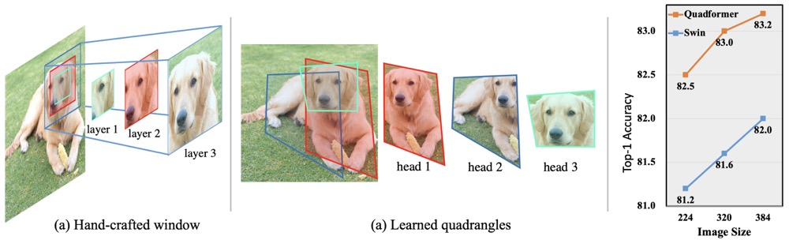

<h1 align="center">[TPAMI 2023] Vision Transformer with Quadrangle Attention<a href="https://arxiv.org/abs/2303.15105">.svg" ></a></h1>
<p align="center">
<h4 align="center">This is the official repository of the paper <a href="https://arxiv.org/abs/2303.15105">Vision Transformer with Quadrangle Attention</a>.</h4>
<h5 align="center"><em>Qiming Zhang, Jing Zhang, Yufei Xu, and Dacheng Tao</em></h5>
<p align="center">
  <a href="#news">News</a> |
  <a href="#abstract">Abstract</a> |
  <a href="#method">Method</a> |
  <a href="#usage">Usage</a> |
  <a href="#results">Results</a> |
  <a href="#statement">Statement</a>
</p>

# Current applications

> **Classification**: Hierarchical models has been released; Plain ones will be released soon.

> **Object Detection**: Will be released soon;

> **Semantic Segmentation**: Will be released soon;

> **Human Pose**: Will be released soon


# News
***24/01/2024***
- The code of hierarchical models on classification has been released.

***30/12/2023***
- The paper is accepted by IEEE Transactions on Pattern Analysis and Machine Intelligence
(TPAMI) with IF 24.314.

***27/03/2023***
- The paper is post on arxiv! The code will be made public available once cleaned up.

# Abstract

<p align="left">This repository contains the code, models, test results for the paper <a href="https://arxiv.org/abs/2303.15105">Vision Transformer with Quadrangle Attention</a>, which is an substantial extention of our ECCV 2022 paper <a href="https://arxiv.org/pdf/2204.08446.pdf">VSA</a>. We extends the window-based attention to a general quadrangle formulation and propose a novel quadrangle attention. We employs an end-to-end learnable quadrangle regression module that predicts a transformation matrix to transform default windows into target quadrangles for token sampling and attention calculation, enabling the network to model various targets with different shapes and orientations and capture rich context information. With minor code modifications and negligible extra computational cost, our QFormer outperforms existing representative (hierarchical and plain) vision transformers on various vision tasks, including classification, object detection, semantic segmentation, and pose estimation.

# Method
<figure>

<figcaption align = "center"><b>Fig.1 - The comparison of the current design (hand-crafted windows) and Quadrange attention.</b></figcaption>
</figure>

<figure>

<figcaption align = "center"><b>Fig.2 - The pipeline of our proposed quadrangle attention (QA).</b></figcaption>
</figure>

<figure>

<figcaption align = "center"><b>Fig.3 - The transformation process in quadrangle attention.</b></figcaption>
</figure>

<figure>

<figcaption align = "center"><b>Fig.4 - The architecture of our plain QFormer<sub>p</sub> (a) and hierarchical QFormer<sub>h</sub> (b).</b></figcaption>
</figure>

# Usage
## Requirements

- PyTorch==1.7.1
- torchvision==0.8.2
- timm==0.3.2

The [Apex](https://github.com/NVIDIA/apex) is optional for faster training speed. 

```
git clone https://github.com/NVIDIA/apex
cd apex
pip install -v --disable-pip-version-check --no-cache-dir --global-option="--cpp_ext" --global-option="--cuda_ext" ./
```

Other Requirements

```
pip install opencv-python==4.4.0.46 termcolor==1.1.0 yacs==0.1.8 timm==0.4.9
pip install einops
```

## Train & Eval

For classification on ImageNet-1K, to train from scratch, run:

```
CUDA_VISIBLE_DEVICES=0,1,2,3,4,5,6,7 \
python -m torch.distributed.launch \
  --nnodes ${NNODES} \
  --node_rank ${SLURM_NODEID} \
  --master_addr ${MHOST} \
  --master_port 25901 \
  --nproc_per_node 8 \
  ./main.py \
  --cfg configs/swin/qformer_tiny_patch4_window7_224.yaml \
  --data-path ${IMAGE_PATH} \
  --batch-size 128 \
  --tag 1024-dpr20-coords_lambda1e-1 \
  --distributed \
  --coords_lambda 1e-1 \
  --drop_path_rate 0.2 \
```

For single GPU training, run
```
python ./main.py \
  --cfg configs/swin/qformer_tiny_patch4_window7_224.yaml \
  --data-path ${IMAGE_PATH} \
  --batch-size 128 \
  --tag 1024-dpr20-coords_lambda1e-1 \
  --coords_lambda 1e-1 \
  --drop_path_rate 0.2 \
```


To evaluate, run:

```
CUDA_VISIBLE_DEVICES=0,1,2,3,4,5,6,7 \
python -m torch.distributed.launch \
  --nnodes ${NNODES} \
  --node_rank ${SLURM_NODEID} \
  --master_addr ${MHOST} \
  --master_port 25901 \
  --nproc_per_node 8 \
  ./main.py \
  --cfg configs/swin/qformer_tiny_patch4_window7_224.yaml \
  --data-path ${IMAGE_PATH} \
  --batch-size 128 \
  --tag eval \
  --distributed \
  --resume ${MODEL PATH} \
  --eval
```
For single GPU evaluation,
run
```
python ./main.py \
  --cfg configs/swin/qformer_tiny_patch4_window7_224.yaml \
  --data-path ${IMAGE_PATH} \
  --batch-size 128 \
  --tag eval \
  --resume ${MODEL PATH} \
  --eval
```

# Results
# Results on plain models

### Classification results on ImageNet-1K with MAE pretrained models
| model | resolution | acc@1 | Weights & Logs |
| :---: | :---: | :---: | :---: |
| ViT-B + Window attn | 224x224 | 81.2 | \ | 
| ViT-B + Shifted window | 224x224 | 82.0 | \ |
| QFormer<sub>p</sub>-B | 224x224 | 82.9 | Coming soon |

### Detection results on COCO with MAE pretrained models and the Mask RCNN detector, following <a href="https://arxiv.org/abs/2203.16527">ViTDet</a>

| model | box mAP | mask mAP | Params | Weights & Logs |
| :---: | :---: | :---: | :---: | :---: |
| ViTDet-B | 51.6 | 45.9 | 111M | \ |
| QFormer<sub>p</sub>-B | 52.3 | 46.6 | 111M | Coming soon |

### Semantic segmentation results on ADE20k with MAE pretrained models and the UPerNet segmentor
| model | image size | mIoU | mIoU* | Weights & Logs |
| :---: | :---: | :---: | :---: | :---: | 
| ViT-B + window attn | 512x512 | 39.7 | 41.8 | \ |
| ViT-B + shifted window attn | 512x512 | 41.6 | 43.6 | \ |
| QFormer<sub>p</sub>-B | 512x512 | 43.6 | 45.0 | Coming soon |
| ViT-B + window attn | 640x640 | 40.2 | 41.5 | \ |
| ViT-B + shifted window attn | 640x640 | 42.3 | 43.5 | \ |
| QFormer<sub>p</sub>-B | 640x640 | 44.9 | 46.0 | Coming soon |

### Human pose estimation results on COCO with MAE pretrained models, following <a href="https://arxiv.org/abs/2204.12484">ViTPose</a>
| attention | model | AP | AP<sub>50</sub> | AR | AR<sub>50</sub> | Weights & Logs |
| :---: | :---: | :---: | :---: | :---: |  :---: |  :---: | 
| Window | ViT-B | 66.4 | 87.7 | 72.9 | 91.9 | \ |
| Shifted window | ViT-B | 76.4 | 90.9 | 81.6 | 94.5 | \ |
| Quadrangle | ViT-B | 77.0 | 90.9 | 82.0 | 94.7| Coming soon |
| Window + Full | ViT-B | 76.9 | 90.8 | 82.1 | 94.7 | \ |
| Shifted window + Full | ViT-B | 77.2 | 90.9 | 82.2 | 94.7 | \ |
| Quadrangle + Full | ViT-B | 77.4 | 91.0 | 82.4 | 94.9 | Coming soon |

# Results on hierarchical models

### Main Results on ImageNet-1K
| name | resolution | acc@1 | acc@5 | acc@RealTop-1 | Weights & Logs |
| :---: | :---: | :---: | :---: | :---: | :---: |
| Swin-T | 224x224 | 81.2 | \ | \ | \ |
| DW-T | 224x224 | 82.0 | \ | \ | \ |
| Focal-T | 224x224 | 82.2 | 95.9 |
| QFormer<sub>h</sub>-T | 224x224 | 82.5 | 96.2 | 87.5 | [model](https://1drv.ms/u/s!AimBgYV7JjTlgcoM6jhtunQzDKSzTQ?e=rVap2P) & [logs](logs/QFormer-T.txt) |
| Swin-S | 224x224 | 83.2 | 96.2 | \ | \ |
| Focal-S | 224x224 | 83.5 | 96.2 | \ | \ |
| QFormer<sub>h</sub>-S | 224x224 | 84.0 |  96.8 | 88.6 | [model](https://1drv.ms/u/s!AimBgYV7JjTlgcoN7NjoE1Pza3dU2A?e=XBh2tl) & [logs](logs/QFormer-S.txt) |
| Swin-B | 224x224 | 83.4 | 96.5 | \ | \ |
| DW-B | 224x224 | 83.4 | \ | \ | \ |
| Focal-B | 224x224 | 83.8 | 96.5 | \ | \ |
| QFormer<sub>h</sub>-B | 224x224 | 84.1 |  96.8 | 88.7 | [model](https://1drv.ms/u/s!AimBgYV7JjTlgcoOX-Wc-CQU_9QDsg?e=xCrdE4) & [logs](logs/QFormer-B.txt) |


## Object Detection Results
### Mask R-CNN

| Backbone | Pretrain | Lr Schd | box mAP | mask mAP | #params | config | log | model |
| :---: | :---: | :---: | :---: | :---: | :---: | :---: | :---: |:---: |
| Swin-T | ImageNet-1K | 1x | 43.7 | 39.8 | 48M | \ | \ | \ |
| DAT-T | ImageNet-1K | 1x | 44.4 | 40.4 | 48M | \ | \ | \ |
| Focal-T | ImageNet-1K | 1x | 44.8 | 41.0 | 49M | \ | \ | \ |
| QFormer<sub>h</sub>-T | ImageNet-1K | 1x | 45.9 | 41.5 | 49M | Coming soon | Coming soon | Coming soon |
| Swin-T | ImageNet-1K | 3x | 46.0 | 41.6 | 48M | \ | \ | \ |
| DW-T | ImageNet-1K | 3x | 46.7 | 42.4 | 49M | \ | \ | \ |
| DAT-T | ImageNet-1K | 3x | 47.1 | 42.4 | 48M | \ | \ | \ |
| DAT-T | ImageNet-1K | 3x | 47.1 | 42.4 | 48M | \ | \ | \ |
| QFormer<sub>h</sub>-T  | ImageNet-1K | 3x | 47.5 | 42.7 | 49M | Coming soon | Coming soon | Coming soon |
| Swin-S | ImageNet-1K | 3x | 48.5 | 43.3 | 69M | \ | \ | \ |
| Focal-S | ImageNet-1K | 3x | 48.8 | 43.8 | 71M | \ | \ | \ |
| DAT-S | ImageNet-1K | 3x | 49.0 | 44.0 | 69M | \ | \ | \ |
| QFormer<sub>h</sub>-S  | ImageNet-1K | 3x | 49.5 | 44.2 | 49M | Coming soon | Coming soon | Coming soon |


### Cascade Mask R-CNN

| Backbone | Pretrain | Lr Schd | box mAP | mask mAP | #params | config | log | model |
| :---: | :---: | :---: | :---: | :---: | :---: | :---: | :---: |:---: |
| Swin-T | ImageNet-1K | 1x | 48.1 | 41.7 | 86M | \ | \ | \ |
| DAT-T | ImageNet-1K | 1x | 49.1 | 42.5 | 86M | \ | \ | \ |
| QFormer<sub>h</sub>-T | ImageNet-1K | 1x | 49.8 | 43.0 | 87M | Coming soon | Coming soon | Coming soon |
| Swin-T | ImageNet-1K | 3x | 50.2 | 43.7 | 86M | \ | \ | \ |
| QFormer<sub>h</sub>-T | ImageNet-1K | 3x | 51.4 | 44.7 | 87M | Coming soon | Coming soon | Coming soon |
| Swin-S | ImageNet-1K | 3x | 51.9 | 45.0 | 107M | \ | \ | \ |
| QFormer<sub>h</sub>-S | ImageNet-1K | 3x | 52.8 | 45.7 | 87M | Coming soon | Coming soon | Coming soon |


## Semantic Segmentation Results for ADE20k
### UperNet

| Backbone | Pretrain | Lr Schd | mIoU | mIoU* | #params | config | log | model |
| :---: | :---: | :---: | :---: | :---: | :---: | :---: | :---: |:---: |
| Swin-T | ImageNet-1k | 160k | 44.5 | 45.8 | 60M | \ | \ | \ |
| DAT-T | ImageNet-1k | 160k | 45.5 | 46.4 | 60M | \ | \ | \ |
| DW-T | ImageNet-1k | 160k | 45.7 | 46.9 | 61M | \ | \ | \ |
| Focal-T | ImageNet-1k | 160k | 45.8 | 47.0 | 62M | \ | \ | \ |
| QFormer<sub>h</sub>-T | ImageNet-1k | 160k | 46.9 | 48.1 | 61M | Coming soon | Coming soon | Coming soon |
| Swin-S | ImageNet-1k | 160k | 47.6 | 49.5 | 81M | \ | \ | \ |
| DAT-S | ImageNet-1k | 160k | 48.3 | 49.8 | 81M | \ | \ | \ |
| Focal-S | ImageNet-1k | 160k | 48.0 | 50.0 | 61M | \ | \ | \ |
| QFormer<sub>h</sub>-S | ImageNet-1k | 160k | 48.9 | 50.3 | 82M | Coming soon | Coming soon | Coming soon |
| Swin-B | ImageNet-1k | 160k | 48.1 | 49.7 | 121M | \ | \ | \ |
| DW-B | ImageNet-1k | 160k | 48.7 | 50.3 | 125M | \ | \ | \ |
| Focal-B | ImageNet-1k | 160k | 49.0 | 50.5 | 126M | \ | \ | \ |
| QFormer<sub>h</sub>-B | ImageNet-1k | 160k | 49.5 | 50.6 | 123M | Coming soon | Coming soon | Coming soon |


# Statement
This project is for research purpose only. For any other questions please contact [qmzhangzz at hotmail.com](mailto:qmzhangzz@hotmail.com).

The code base is borrowed from [Swin](https://github.com/microsoft/Swin-Transformer).

## Citing QFormer, VSA and ViTAE
```
@article{zhang2023vision,
  title={Vision Transformer with Quadrangle Attention},
  author={Zhang, Qiming and Zhang, Jing and Xu, Yufei and Tao, Dacheng},
  journal={arXiv preprint arXiv:2303.15105},
  year={2023}
}
@inproceedings{zhang2022vsa,
  title={VSA: learning varied-size window attention in vision transformers},
  author={Zhang, Qiming and Xu, Yufei and Zhang, Jing and Tao, Dacheng},
  booktitle={Computer Vision--ECCV 2022: 17th European Conference, Tel Aviv, Israel, October 23--27, 2022, Proceedings, Part XXV},
  pages={466--483},
  year={2022},
  organization={Springer}
}
@article{zhang2023vitaev2,
  title={Vitaev2: Vision transformer advanced by exploring inductive bias for image recognition and beyond},
  author={Zhang, Qiming and Xu, Yufei and Zhang, Jing and Tao, Dacheng},
  journal={International Journal of Computer Vision},
  pages={1--22},
  year={2023},
  publisher={Springer}
}
@article{xu2021vitae,
  title={Vitae: Vision transformer advanced by exploring intrinsic inductive bias},
  author={Xu, Yufei and Zhang, Qiming and Zhang, Jing and Tao, Dacheng},
  journal={Advances in Neural Information Processing Systems},
  volume={34},
  year={2021}
}
```

# Our other Transformer works

> **ViTPose**: Please see <a href="https://github.com/ViTAE-Transformer/ViTPose">Baseline model ViTPose for human pose estimation</a>;

> **VSA**: Please see <a href="https://github.com/ViTAE-Transformer/ViTAE-VSA">ViTAE-Transformer for Image Classification and Object Detection</a>;

> **ViTAE & ViTAEv2**: Please see <a href="https://github.com/ViTAE-Transformer/ViTAE-Transformer">ViTAE-Transformer for Image Classification, Object Detection, and Sementic Segmentation</a>;

> **Matting**: Please see <a href="https://github.com/ViTAE-Transformer/ViTAE-Transformer-Matting">ViTAE-Transformer for matting</a>;

> **Remote Sensing**: Please see <a href="https://github.com/ViTAE-Transformer/ViTAE-Transformer-Remote-Sensing">ViTAE-Transformer for Remote Sensing</a>; <a href="https://github.com/ViTAE-Transformer/Remote-Sensing-RVSA">Advancing Plain Vision Transformer Towards Remote Sensing Foundation Model
</a>; 
